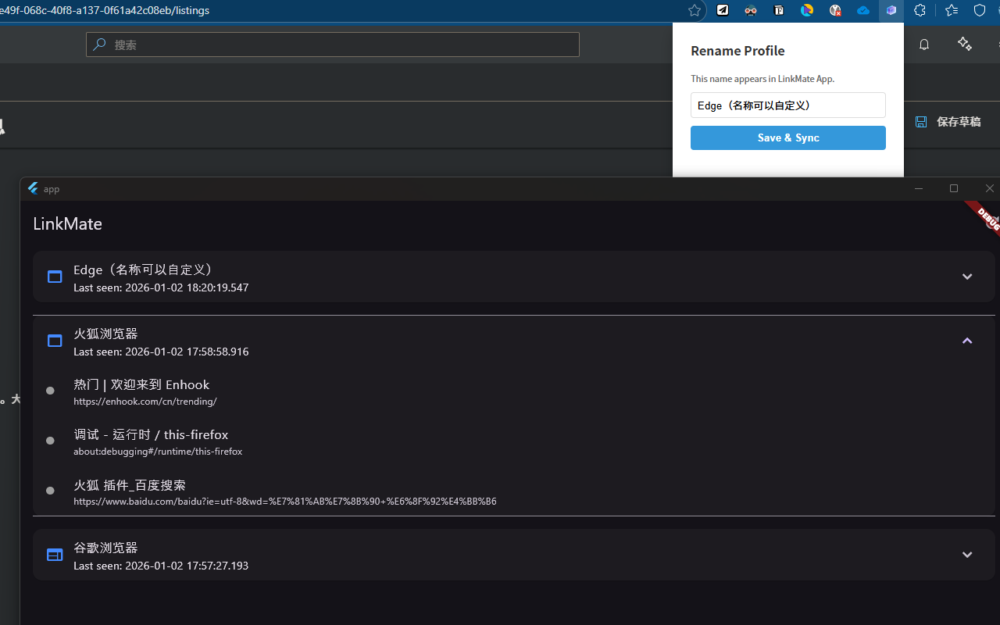

# LinkMate
An open-source, cross-platform URL toolkit

v1.0.0 Release

【Implemented】

Achieved communication between the browser extension and the desktop application via vibe coding. Capabilities include:
- Real-time display of tab status across different browsers

【In Progress】
- Upload extension to the Edge Add-ons Store
- pload extension to the Chrome Web Store (blocked, requires registration with a Visa card)
- Upload extension to the Firefox Add-ons Store (not initiated yet)

【Future Plans】
- [ ] Tab statistics and analysis (record the open count of each tab/link, support viewing current session statistics and historical cumulative statistics)
- [ ] Link health check (batch detect link accessibility, display response time and status)
- [ ] Tab operations (create, edit, delete groups; quickly move groups from Browser A to Browser B; group snapshot feature: save current group status and support one-click restoration)
- [ ] Smart redirection (take over the system http(s) redirection process, automatically select the browser based on rules. Example: GitHub links → Chrome, Linux.do links → Edge)
- [ ] Global search and filtering
- [ ] Data storage (currently stored in SQLite; multi-end storage will be supported later leveraging Flutter's cross-platform capabilities)
- [ ] TAI intelligent features with custom key and baseURL (automatic group categorization suggestions, summary generation)

